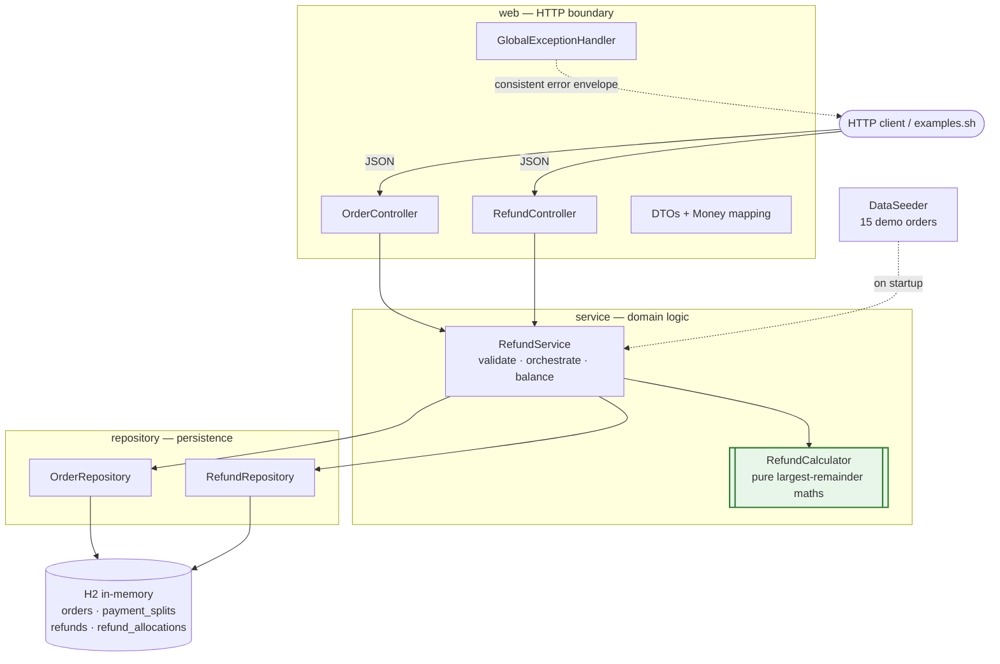
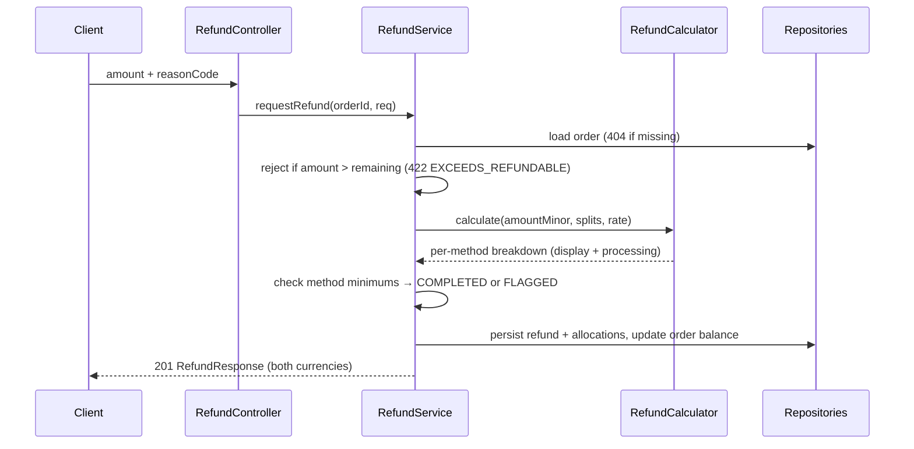

# Smart Partial Refund Engine

[](https://github.com/Sushank34/smart-partial-refund-engine/actions/workflows/ci.yml)

A backend service that handles complex partial-refund scenarios for B2B / marketplace orders:
proportional distribution across split payment methods, multi-currency conversion at the
**historical** exchange rate, and a complete, queryable audit trail — with no cents ever lost
to rounding.

Built for the Andino Wholesale challenge. Spring Boot 3 · Java 17 · in-memory H2 · zero external infra.

---

## Quick start (under 5 minutes)

Requires JDK 17+ and Maven.

```bash
# 1. Run the service (seeds 15 demo orders on startup)
mvn spring-boot:run

# 2. In another terminal, exercise all three core requirements end-to-end
./examples.sh
```

The service listens on **http://localhost:8086**.

- Swagger UI: http://localhost:8086/swagger-ui.html
- H2 console: http://localhost:8086/h2-console (JDBC URL `jdbc:h2:mem:refunds`, user `sa`, no password)
- Health: http://localhost:8086/health

Run the tests (11 tests covering the refund maths and the service rules):

```bash
mvn test
```

Docker, if you prefer: `docker build -t refund-engine . && docker run -p 8086:8086 refund-engine`

---

## What it does — the three core requirements

### 1. Proportional refund distribution
A refund is split back across the order's payment methods in proportion to how much each one
originally funded. Refund `$300` of a `$500 / $300 / $200` order and you get `$150 / $90 / $60`.
**The split always sums exactly to the requested amount** — see the rounding note below.

### 2. Multi-currency handling
Each order stores the historical `exchangeRate` (display → processing) captured at payment time.
Every refund returns amounts in **both** currencies. Refund `$300 USD` on a USD→PEN order at
rate `3.75` and each allocation shows both the USD figure and its PEN equivalent, with the PEN
allocations also summing exactly to `1125.00 PEN`.

### 3. Refund audit trail
Every refund is persisted as an immutable record — order id, requested amount (both currencies),
reason code, status, timestamp, and the full per-method breakdown. Issue many partial refunds on
one order and `GET …/refunds` returns the complete history, oldest first. Refunds can never exceed
the order's remaining balance.

---

## The refund calculation logic (the important part)

All money is stored and computed as **integer minor units (cents) in a `long`** — never floating
point. The API accepts and returns major units (e.g. `300.00`); conversion happens at the edge in
[`Money`](src/main/java/com/refund/service/Money.java).

The core algorithm lives in
[`RefundCalculator`](src/main/java/com/refund/service/RefundCalculator.java) and is a pure,
side-effect-free function (independently unit-tested). It uses the **largest-remainder method**
(Hamilton apportionment):

1. Compute each method's exact share as `requested × weightᵢ / totalWeight` using integer maths,
   keeping the **floor** and the **remainder**.
2. The floors always sum to *at most* the requested amount; the shortfall is a whole number of
   leftover cents, strictly fewer than the number of methods.
3. Hand those leftover cents out one at a time to the methods with the **largest remainders**
   (ties broken by larger original weight, then lowest index — fully deterministic).

This guarantees `Σ allocations == requested`, exactly, for every input. The classic failure case —
splitting `$0.10` three ways — yields `0.04 / 0.03 / 0.03`, never `0.03 / 0.03 / 0.03` (lost cent)
or `0.04 / 0.04 / 0.04` (invented cent).

**Multi-currency:** the processing-currency total is computed once
(`round(requestedMinor × rate)`, half-up) and then run through the *same* largest-remainder split
using the same weights. So both currencies' allocations sum exactly to their own totals, with no
drift between them.

---

## API reference

Base URL: `http://localhost:8086`. All amounts are major units (e.g. `300.00`). Full schema at
[`API.md`](API.md) and live at `/swagger-ui.html`.

| Method | Path | Purpose |
| --- | --- | --- |
| `POST` | `/api/orders` | Record an order with payment splits + currency info |
| `GET`  | `/api/orders` | List all orders (handy for discovering the seeded demo data) |
| `GET`  | `/api/orders/{orderId}` | Fetch an order and its remaining refundable balance |
| `POST` | `/api/orders/{orderId}/refunds` | Issue a partial refund; returns the breakdown |
| `GET`  | `/api/orders/{orderId}/refunds` | Retrieve the full refund history |
| `GET`  | `/health` | Liveness probe |

### Create an order

```bash
curl -X POST http://localhost:8086/api/orders -H 'Content-Type: application/json' -d '{
  "displayCurrency": "USD",
  "processingCurrency": "PEN",
  "exchangeRate": 3.75,
  "payments": [
    { "method": "WALLET",        "amount": 500.00 },
    { "method": "CREDIT_CARD",   "amount": 300.00 },
    { "method": "BANK_TRANSFER", "amount": 200.00 }
  ]
}'
```

The order total is **derived** from the sum of the payments, so the splits are always consistent.
`exchangeRate` is optional and defaults to `1` when display and processing currencies match.

### Request a partial refund

```bash
curl -X POST http://localhost:8086/api/orders/{orderId}/refunds \
  -H 'Content-Type: application/json' \
  -d '{ "amount": 300.00, "reasonCode": "PARTIAL_CANCELLATION" }'
```

Response (abridged):

```json
{
  "id": "rf_b7477d36",
  "orderId": "ord_833aa72a",
  "reasonCode": "PARTIAL_CANCELLATION",
  "status": "COMPLETED",
  "displayCurrency": "USD",
  "processingCurrency": "PEN",
  "requestedDisplayAmount": 300.00,
  "requestedProcessingAmount": 1125.00,
  "allocations": [
    { "method": "WALLET",        "displayAmount": 150.00, "processingAmount": 562.50, "instant": true,  "settlementDays": 0 },
    { "method": "CREDIT_CARD",   "displayAmount": 90.00,  "processingAmount": 337.50, "instant": false, "settlementDays": 5 },
    { "method": "BANK_TRANSFER", "displayAmount": 60.00,  "processingAmount": 225.00, "instant": false, "settlementDays": 3 }
  ]
}
```

`reasonCode` ∈ `PARTIAL_CANCELLATION`, `ITEM_OUT_OF_STOCK`, `DAMAGED_GOODS`, `CUSTOMER_REQUEST`, `OTHER`.
`method` ∈ `WALLET`, `CREDIT_CARD`, `DEBIT_CARD`, `BANK_TRANSFER`.

### Error responses

Consistent envelope `{ "status", "code", "error" }`:

| Scenario | HTTP | code |
| --- | --- | --- |
| Refund exceeds remaining balance | 422 | `EXCEEDS_REFUNDABLE` |
| Unknown order | 404 | `ORDER_NOT_FOUND` |
| Missing rate across currencies | 422 | `EXCHANGE_RATE_REQUIRED` |
| Non-positive / missing amount | 400 | `VALIDATION_ERROR` |
| Malformed JSON or bad enum | 400 | `MALFORMED_REQUEST` |

---

## Stretch goals (both implemented)

- **Maximum refundable enforcement** — a refund that would push total refunds past the order
  amount is rejected with `422 EXCEEDS_REFUNDABLE`, accounting for all previously issued refunds.
- **Payment-method constraint validation** — each method carries a minimum refundable amount
  (cards/bank `$1.00`, wallet none). If an allocation falls below its minimum, the refund is
  recorded with status `FLAGGED` and an explanatory `note`, rather than silently issuing an
  invalid downstream refund. Settlement timing (`instant` / `settlementDays`) is surfaced per
  allocation too.

---

## Test data

[`DataSeeder`](src/main/java/com/refund/config/DataSeeder.java) loads 16 orders on startup:

- **`ord_1001`–`ord_1005`** — single payment method
- **`ord_1006`–`ord_1010`** — two methods
- **`ord_1011`–`ord_1015`** — three or four methods
- **`ord_1016`** — a Bolivia (BOB) order, completing the four operating markets

across five currency pairings — USD→PEN `3.75`, USD→COP `3950.50`, EUR→USD `1.08`, USD→BOB `6.90`,
and same-currency at `1` — with amounts spanning `$50` to `$5,000`. `ord_1006` arrives with one
prior refund and `ord_1011` with two, to exercise the audit trail out of the box. `ord_1014` is an
even three-way split — the canonical rounding edge case. Browse them all via `GET /api/orders`.

---

## Architecture & design decisions

A single Spring Boot service, layered so the refund maths is isolated and pure. Requests flow
controller → service → calculator/repositories; the calculator never touches the database.



**Refund request flow** (`POST /api/orders/{id}/refunds`):



```
com.refund
├── domain/      Order, PaymentSplit, Refund, RefundAllocation + enums  (entities, no logic leakage)
├── repository/  Spring Data JPA repositories
├── service/     RefundCalculator (pure maths) · RefundService (orchestration) · Money
├── web/         Controllers · GlobalExceptionHandler · DTOs
└── config/      OpenApiConfig · DataSeeder
```

- **Layered, thin controllers.** Controllers map HTTP ↔ DTOs; `RefundService` orchestrates
  validation + persistence + balance updates; `RefundCalculator` holds the money maths as pure
  functions so it is trivially testable in isolation.
- **Integer minor units everywhere.** The single most important correctness decision — no
  `double`, no accumulated float error.
- **Allocations persisted, not recomputed.** Each refund stores its own breakdown, so history is a
  faithful audit record even if rates or rules later change.

### Assumptions & trade-offs (2-hour sprint)

- **All currencies assumed 2-decimal.** A production system would use a per-currency exponent table
  (JPY = 0, etc.). Documented in `Money`.
- **Refunds are amount-based, not line-item.** The brief's item-cancellation story reduces to "refund
  amount X"; modelling SKUs/quantities added complexity without scoring points.
- **Payment-method minimums are nominal and in display currency.** Real rules are gateway- and
  currency-specific.
- **Refunds settle synchronously and are assumed to succeed.** No async processing, gateway calls,
  retries, or idempotency keys — out of scope for a prototype.
- **In-memory H2 with `create-drop`.** Data resets each run; re-seeded on startup. No auth (per brief).
- **`FLAGGED` refunds are still recorded.** The brief says "flag it or suggest an adjustment" — we
  flag and proceed rather than block, leaving the operational decision to a human.
```
